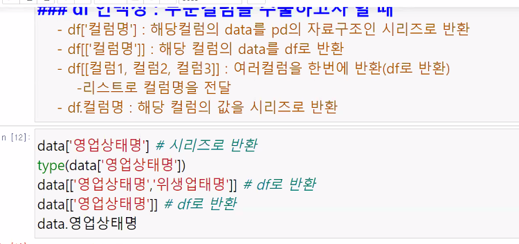

### pandas
df['col'] : 해당 col의 data를 시리즈로 반환 
df[['col']] : 해당 col의 data를 df로 반환

```python
import pandas as pd

# DataFrame 생성
df = pd.DataFrame({
    'A': [1, 2, 3],
    'B': [4, 5, 6]
})

# Series 객체 반환
print(type(df['A']))  # <class 'pandas.core.series.Series'>
print(df['A'])
"""
0    1
1    2
2    3
Name: A, dtype: int64
"""

# DataFrame 객체 반환
print(type(df[['A']]))  # <class 'pandas.core.frame.DataFrame'>
print(df[['A']])
"""
   A
0  1
1  2
2  3
"""
```