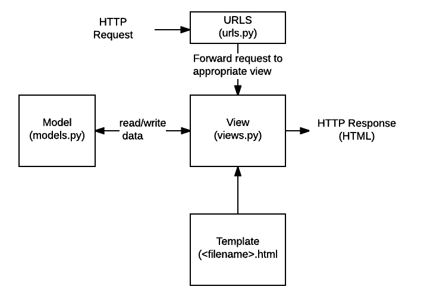

## Django 흐름도

* 요청은 URL!
* View가 필요에 따라 분석해서
* HTML로 응답함.

## 디자인 패턴
다수의 시행착오를 통해 발견된 현재까지의 가장 우수한 해결책

##
* python manage.py runserver # 서버 구동
* python manage.py startapp first_app # 프로젝트 생성
* settings > INSTALLED_APPS = > 'first_app', #프로젝트 등록(출생신고?)
* 프로젝트 폴더 > View 함수 > templates에 def 생성
```
def 함수이름(request) context={} return render(request, 'html', context) 
```
